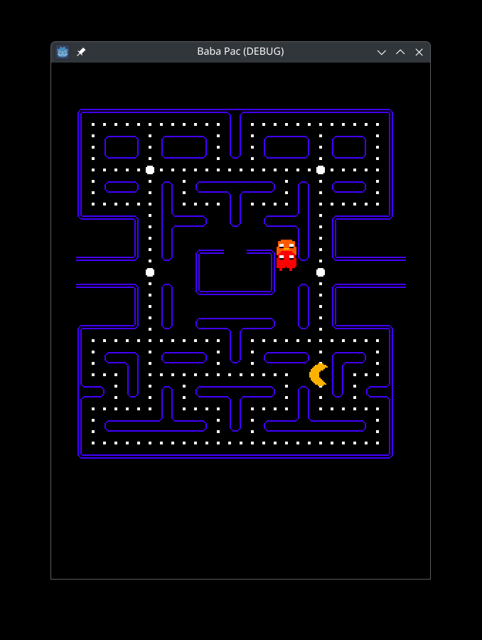

# Baba - Pac

Game dev training inspired by Pacman



## About

The game is broken. But the goal was to explore the tilemaping and pathfinding methods. I also player with [Aseprite](https://www.aseprite.org/) to create sprites.

## Features

Use the arrows to move pacman.

## Getting Started

### Prerequisites

- [Godot Engine 4.4](https://godotengine.org/download)

### Installation

1. **Clone the repository:**

    ```
    git clone https://github.com/peebam/baba-pac
    ```

2. **Open the project in Godot Engine 4.4.**

3. **Run the project.**
